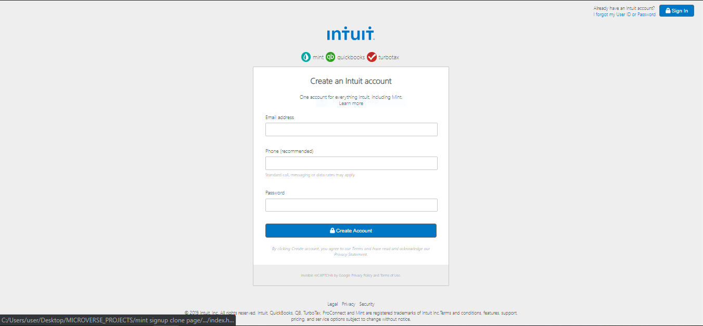

# Project Name
Mint Signup Cloned Page

## Table of contents
* [General info](#general-info)
* [Screenshots](#screenshots)
* [Technologies](#technologies)
* [Setup](#setup)
* [Features](#features)
* [Status](#status)
* [Inspiration](#inspiration)
* [Contact](#contact)

## General info
The purpose of this project is to mimic the Mint signup page. It is a Mint signup page cloned to look like the real life website, <a href="https://accounts.intuit.com/signup.html?offering_id=Intuit.ifs.mint&namespace_id=50000026&redirect_url=https%3A%2F%2Fmint.intuit.com%2Foverview.event%3Futm_medium%3Ddirect%26cta%3Dhero_sign_up_free_ProspectWeb%26adobe_mc%3DMCMID%253D14238000349403266906560760860426824917%257CMCAID%253D2EAA47C105314B4C-4000010B40006040%257CMCORGID%253D969430F0543F253D0A4C98C6%252540AdobeOrg%257CTS%253D1566321481%26ivid%3D58586c37-6d4c-4b63-b119-ac7470806661" target="_blank" >Mint.com's signup page</a>. It is a collaborative effort by <a href="https://github.com/adaorachi" target="_blank">MaryAnn Chukwuka</a> and <a href="https://github.com/JayKowski" target="_blank"> Judah Maina </a>

## Screenshots

## Technologies
* HTML5
* CSS3

## Setup
This project is built with the basic web page structures and styling. It is pretty simple to setup. All you have to do is to clone the project into your local repository. 
Find attatched below a preview of the project:
<a href="https://raw.githack.com/adaorachi/mint-signup-cloned-form/development/index.html">Mint signup cloned form preview </a>

## Features
List of features ready and TODOs for future development
* We do not have any future or TODO developement for now. We will definitely give out a notice should we decide to.

## Status
The project is currently finished.

## Inspiration
The inspiration for this project was gotten from <a href="https://accounts.intuit.com/signup.html?offering_id=Intuit.ifs.mint&namespace_id=50000026&redirect_url=https%3A%2F%2Fmint.intuit.com%2Foverview.event%3Futm_medium%3Ddirect%26cta%3Dhero_sign_up_free_ProspectWeb%26adobe_mc%3DMCMID%253D14238000349403266906560760860426824917%257CMCAID%253D2EAA47C105314B4C-4000010B40006040%257CMCORGID%253D969430F0543F253D0A4C98C6%252540AdobeOrg%257CTS%253D1566321481%26ivid%3D58586c37-6d4c-4b63-b119-ac7470806661" target="_blank" >Mint.com's signup page</a>. The aesthetic designs are awesome and sleek.

## Contact
Created by [@MaryAnn Chukwuka](https://github.com/adaorachi) and [@Judah Maina](https://github.com/JayKowski) - feel free to contact us!

